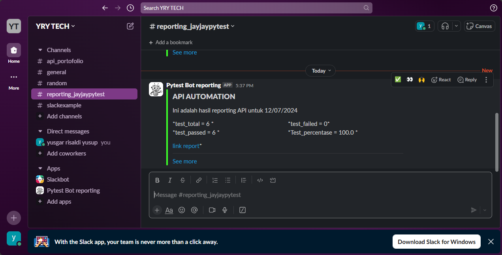
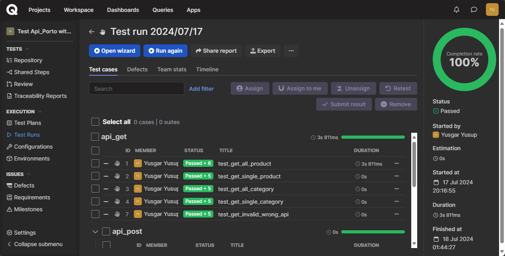
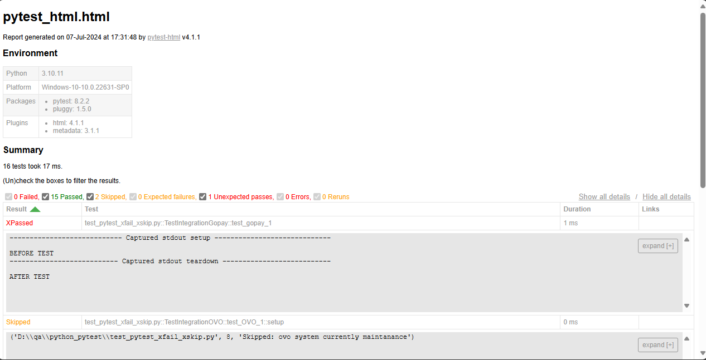

# mini_project_api_automation_with_python

# Proyek Pengujian API Automation ini menggunakan Request, Phyton, Pytest, dengan konsep Page Objek Model
-Api ini dibuat berdasarkan api dari https://reqres.in/

Proyek ini mengimplementasikan pengujian otomatis untuk Api menggunakan Pytest sebagai library pengujian berbasis behavior-driven development (BDD), Phyton untuk bahasa pemrograman.

## instal library
-pip install -r requirements.txt 

## Tujuan Proyek
- Mengelola dan menjalankan pengujian otomatis untuk metode get,create,delete pada Api
- Memastikan bahwa Api berperilaku sesuai dengan spesifikasi dalam berbagai skenario.

## Cara Menjalankan Pengujian
pytest Test/ -s     = run with debug
pytest Test/ -v     = run all test with desc
pytest  Test/       = run all test

## Struktur Proyek
- .setting/case_management.py     = folder/file to integrate with test management tools (exp : QASE.IO)
- .setting/endpoint.py            = folder/file to list our endpoint fo testing
- .setting/general.py             = folder/file to setting our project run
- .setting/notif_slack.py         = folder/file to integrate with slack (exp: notification test)
- .Test/conftest.py               = folder/file to make hooks test
- .test                           = folder/file to make our test (exp: unit/e2e/integration/etc)
- pytest.ini                      = folder/file to setting our pytest

 ## Slack Report
  - 
    
  ## QaseIO Report
  - 

 ## Html(Netlify Deploy) Report
  - 

---
